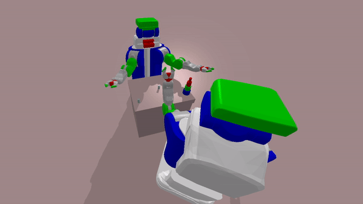
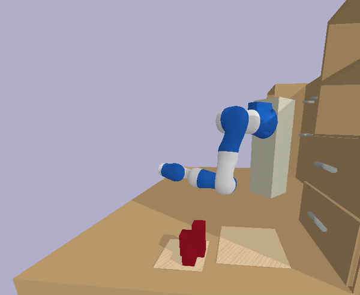
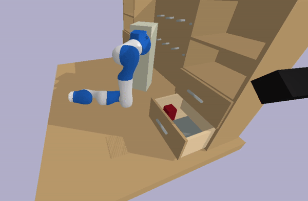

# eTAMP and CP-BO

1) eTAMP: https://arxiv.org/pdf/2103.05456.pdf
2) CP-BO: 

## Installation

### Compiling the Top-k Planner
```console
.../eTAMP$ ./symk/build.py
```

## Examples

### Kitchen domain


### HanoiTower domain



### Unpacking domain



### Regrasping domain



