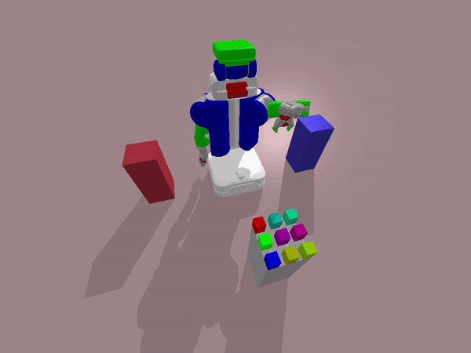

## To start

1. `git clone --recurse-submodules [url]`: to clone this repo with submodules
1. `./symk/build.py `: to build the symk planner


## Run examples

```console
export PYTHONPATH="[full path of the repo]"
```

### Kitchen

```console
python3 PR2/TASK_cook/run_eTAMP.py
```




### Unpacking

```console
python3 Darias/TASK_unpack/run_eTAMP.py
```


### Regrasping

```console
python3 Darias/TASK_regrasp/run_eTAMP.py
```


## References

### Main source

1. [eTAMP](https://arxiv.org/pdf/2103.05456.pdf): a integrated task and motion planner for robot applications
2. [CP-BO](https://arxiv.org/pdf/2201.09612.pdf): to accelerate eTAMP via geometric constraint learning

### Based on

1. [symk (based on fastdownward)](https://github.com/speckdavid/symk): a top-k symbolic planner (interchangeable)
2. [pddlstream](https://github.com/caelan/pddlstream): useful operator definitions and test environments

